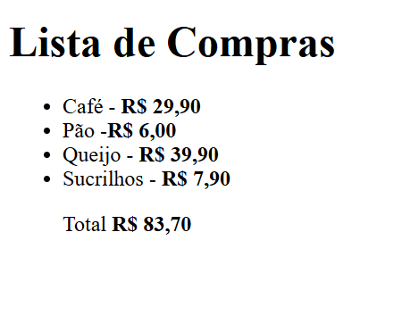
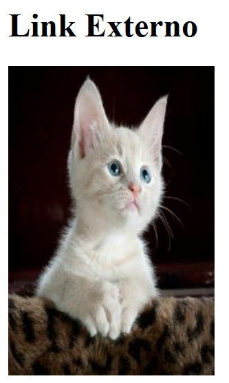
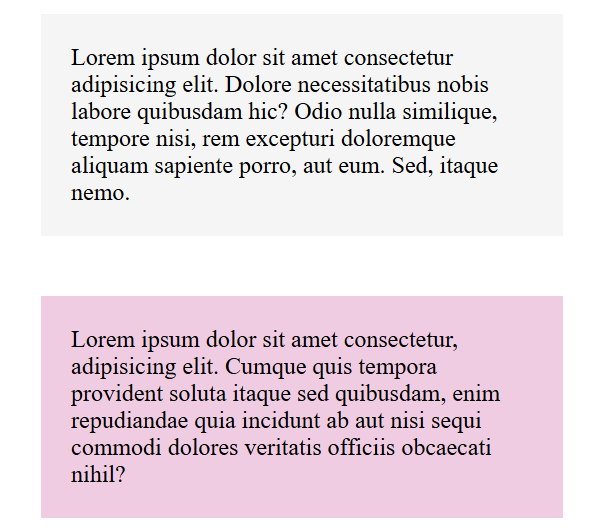

# 💻 Exercícios HTML e CSS - DevQuest

Este repositório contém os exercícios desenvolvidos por mim durante o curso **DevQuest**, com foco nos fundamentos de **HTML5** e **CSS3**. A proposta é aplicar os conceitos vistos em aula de forma prática e visual.

---

## 📁 Estrutura do Repositório

| Pasta                                   | Descrição |
|----------------------------------------|-----------|
| `01-exercicios-lista-de-compras`       | Lista de compras com elementos de texto e formatação de valores |
| `02-exercicio-link-externo`            | Inserção de imagem e link externo com HTML |
| `03-exercícios-paragrafos`             | Estruturação de parágrafos e aplicação de cores com CSS |

---

## 🖼️ Exemplos dos Exercícios

### 🛒 Lista de Compras

---

### 🐱 Link Externo com Imagem

---

### 📄 Estilização de Parágrafos

---

## 🛠️ Tecnologias Utilizadas

- HTML5
- CSS3
- VS Code
- Git & GitHub

---

## 🎯 Objetivo

Praticar a construção de páginas web simples, usando marcação semântica e estilização com CSS, desenvolvendo a base necessária para projetos futuros.

---

## 🙋‍♀️ Sobre Mim

Desenvolvedora em transição de carreira, apaixonada por tecnologia e construção de interfaces. Atualmente focada em Front-end com HTML, CSS, JavaScript e Git.

📧 Contato: anacarolina.ribeiro.s@gmail.com  
🚧 Portfólio em construção!

---
